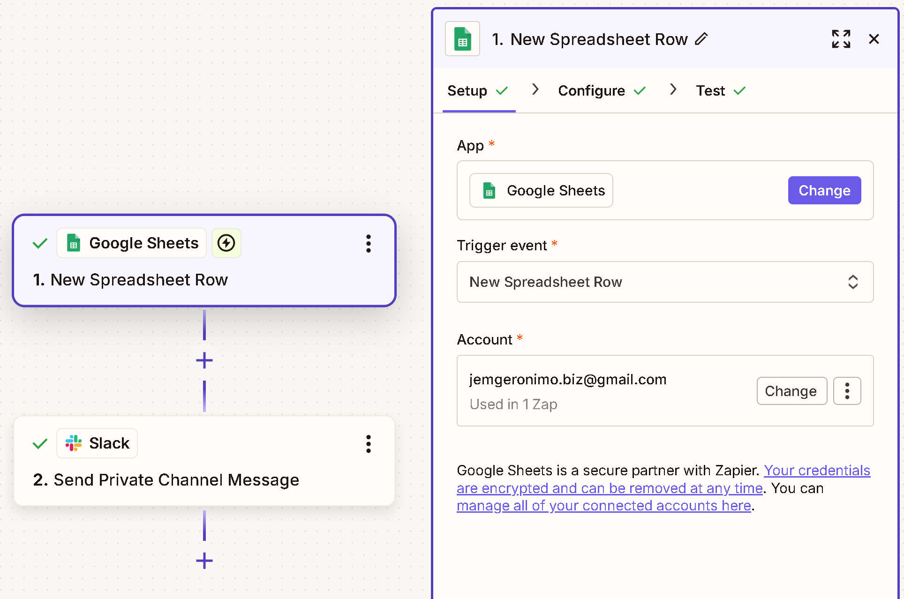
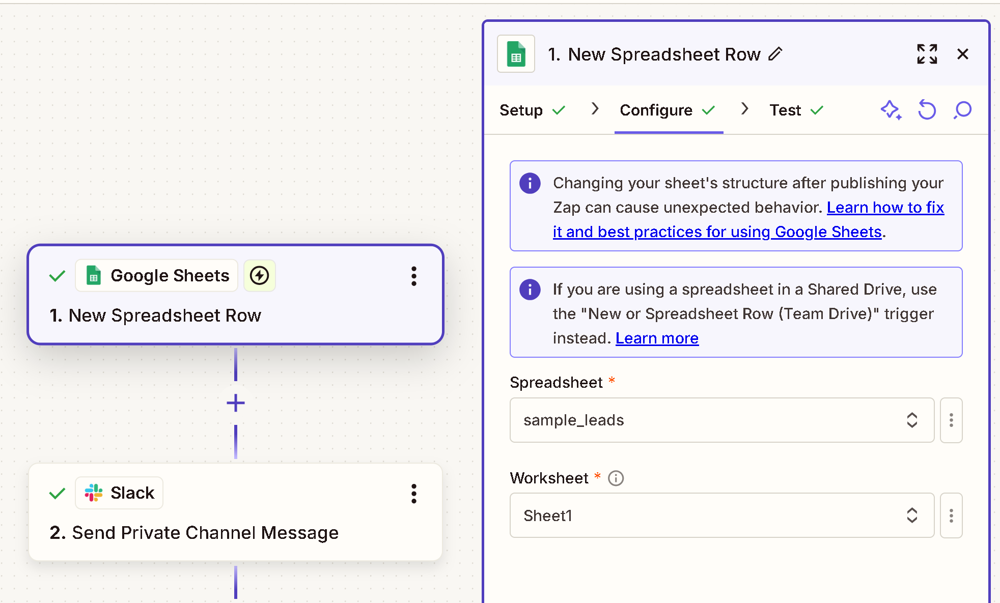
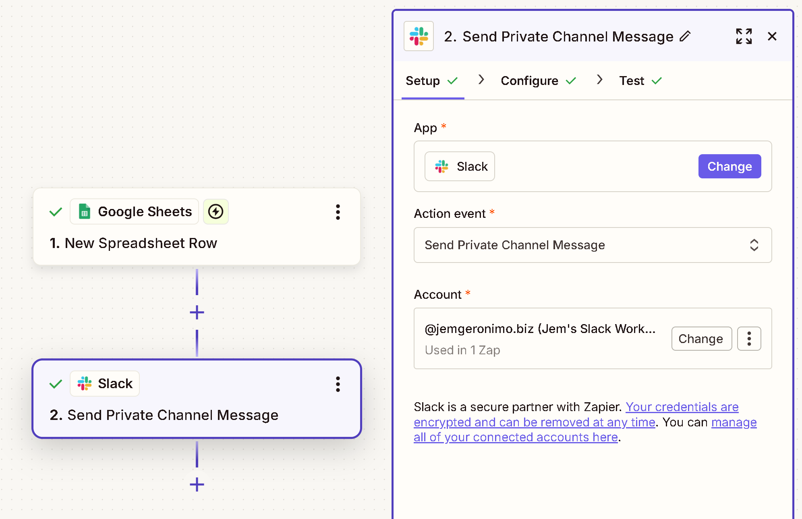
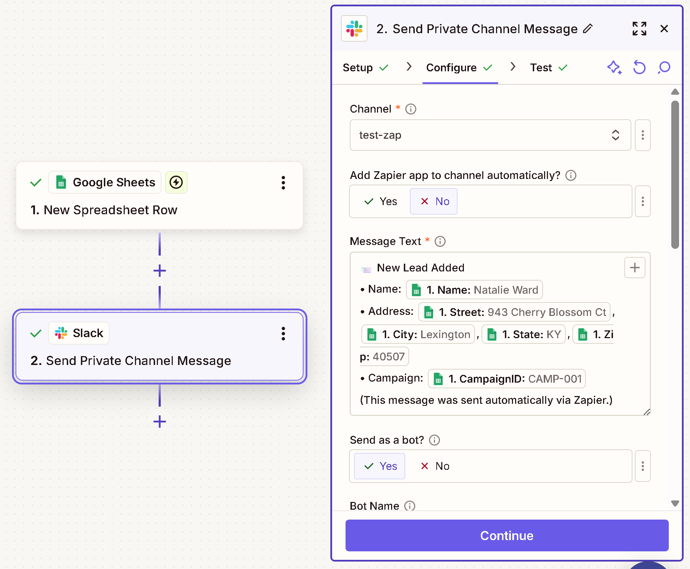
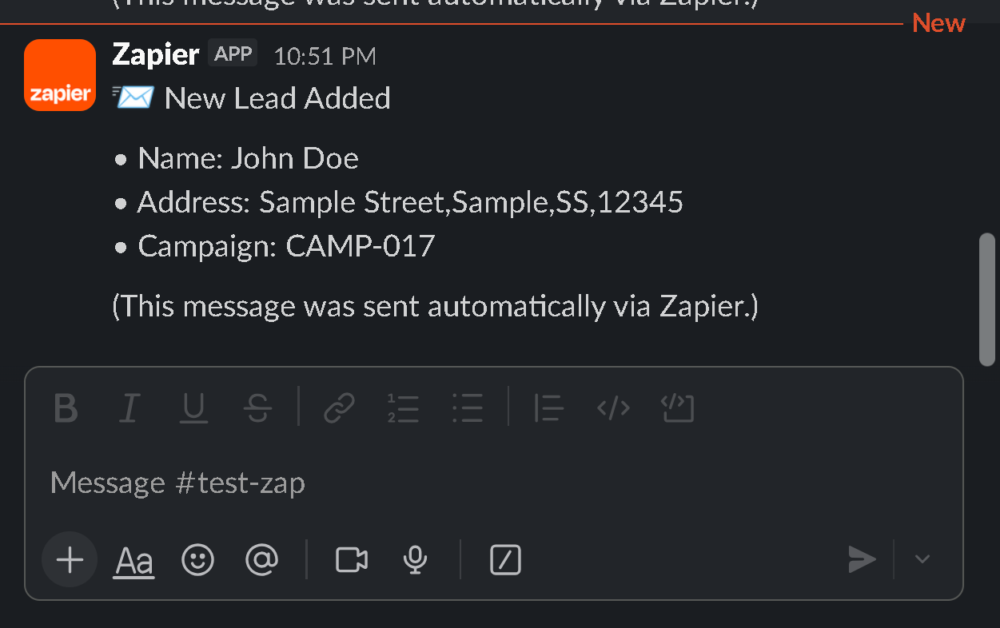

# Google Sheets → Slack Lead Alert Automation

A simple, portfolio-ready automation project demonstrating how to use Zapier to send formatted Slack notifications whenever a new lead is added to a Google Sheet.

This mirrors a real-world workflow used in small businesses, agencies, and sales teams — and showcases Zapier fundamentals like trigger setup, action mapping, and message formatting.

---

## 📌 Project Overview

This automation monitors a Google Sheet for newly added rows. Whenever a new lead appears, Zapier sends a structured message to a Slack channel. This is useful for:

* Lead intake workflows
* Team notifications
* Data collection pipelines
* Internal alerts

This project includes:

* A sample Google Sheet with synthetic lead data
* A Zap with two steps:

  * Trigger: New Spreadsheet Row (Google Sheets)
  * Action: Send Private Channel Message (Slack)
* Screenshots of each configuration step
* A Zap diagram for high-level understanding

---

## 📁 Project Structure

```
.
├── README.md
├── assets/
│   ├── 01-gsheets-trigger-setup.png
│   ├── 02-gsheets-trigger-configure.png
│   ├── 03-slack-action-setup.png
│   ├── 04-slack-action-configure.png
│   ├── zap-diagram.png
│   └── slack-test.png
└── data/
    └── sample_leads.csv
```

---

## 🧩 Zap Overview Diagram


This provides a quick visual summary of the entire workflow.

---

## ⚙️ Step 1 — Google Sheets Trigger Setup

**Trigger:** New Spreadsheet Row



Here, Zapier is configured to monitor a specific spreadsheet and worksheet. The trigger fires whenever a *new* row is appended to the bottom of the sheet.

---

## ⚙️ Step 2 — Google Sheets Trigger Configure



Key fields:

* **Spreadsheet:** `sample_leads`
* **Worksheet:** `Sheet1`

Adding new entries must be done **at the bottom** to maintain consistent trigger behavior.

---

## 💬 Step 3 — Slack Action Setup

**Action:** Send Private Channel Message



Select:

* Slack workspace
* Action type (`Send Private Channel Message`)

---

## 💬 Step 4 — Slack Action Configure



Example message format:

```
📨 New Lead Added

• Name: {{Name}}
• Address: {{Street}}, {{City}}, {{State}} {{Zip}}
• Campaign: {{CampaignID}}

(This message was sent automatically via Zapier.)
```

Data fields are mapped from the Google Sheet.

---

## 📝 Sample Output



This is how the message appears in Slack after a successful test.

---

## 🚨 Notes & Best Practices

* Always add new rows **at the end of the sheet**.
* Avoid inserting rows in the middle, as this can cause Zapier to re-scan the entire sheet.
* Keep column headers consistent.
* Test each Zap step after making changes to the spreadsheet structure.

---

## 🧪 How to Recreate This Project

1. Create a Google Sheet with headers: `Name`, `Street`, `City`, `State`, `Zip`, `CampaignID`.
2. Add sample lead entries.
3. Create a Slack channel for notifications.
4. Build the Zap using the steps and screenshots above.
5. Test with a new row added at the bottom of the sheet.

---

## 🎯 Why This Project Matters

This project demonstrates:

* Clean Zapier setup
* Working knowledge of Google Sheets triggers
* Structured Slack notifications
* Understanding of common automation pitfalls

It’s an ideal starter automation for a freelance portfolio, showing clarity, reliability, and real-world usefulness.

---

If you'd like to expand this project (e.g., add filters, add a second action, log Slack messages, or build a small API to receive leads), you can easily build on this foundation.
